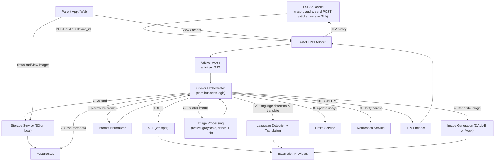

```mermaid
flowchart TD

ESP32["ESP32 Device<br>(record audio, send POST /sticker, receive TLV)"]

API["FastAPI API Server"]
Routes["/sticker POST<br>/stickers GET"]

Orch["Sticker Orchestrator<br>(core business logic)"]

STT["STT (Whisper)"]
LANG["Language Detection + Translation"]
NORM["Prompt Normalizer"]
IMGGEN["Image Generation (DALL·E or Mock)"]
IMGPROC["Image Processing<br>(resize, grayscale, dither, 1-bit)"]
STORE["Storage Service (S3 or local)"]
DB["PostgreSQL"]
LIMITS["Limits Service"]
NOTIF["Notification Service"]
TLV["TLV Encoder"]

AI["External AI Providers"]
ParentApp["Parent App / Web"]

ESP32 -->|POST audio + device_id| API
API --> Routes
Routes --> Orch

Orch -->|1. STT| STT
STT --> AI

Orch -->|2. Language detection & translate| LANG
LANG --> AI

Orch -->|3. Normalize prompt| NORM
NORM --> Orch

Orch -->|4. Generate image| IMGGEN
IMGGEN --> AI

Orch -->|5. Process image| IMGPROC
IMGPROC --> Orch

Orch -->|6. Upload| STORE
STORE --> DB

Orch -->|7. Save metadata| DB
Orch -->|8. Update usage| LIMITS
Orch -->|9. Notify parent| NOTIF

Orch -->|10. Build TLV| TLV
TLV --> API
API -->|TLV binary| ESP32

ParentApp -->|view / reprint| API
ParentApp -->|download/view images| STORE
```